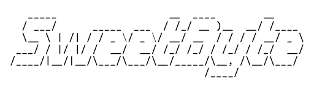
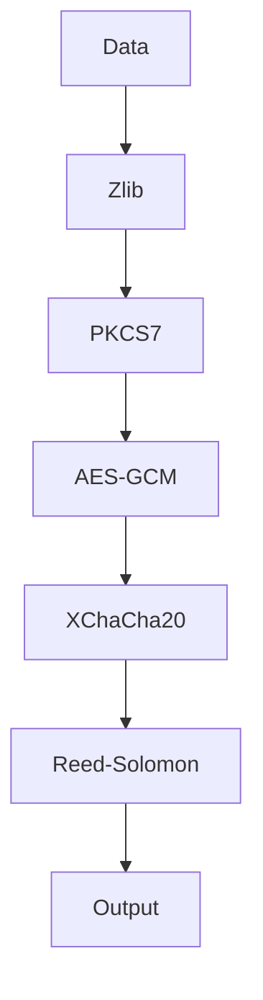
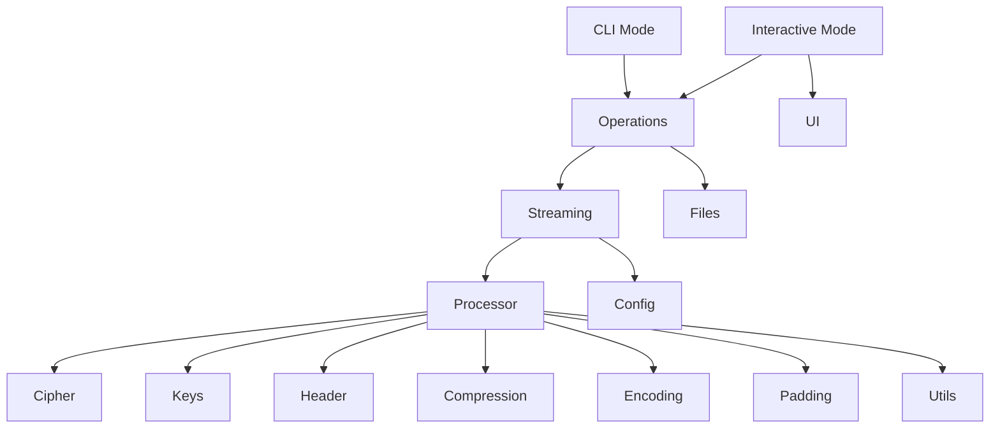

<div align="center">



**A resilient, secure, and efficient file encryption tool.**

[](https://github.com/hambosto/sweetbyte/actions/workflows/quality-checks.yaml)
[](https://goreportcard.com/report/github.com/hambosto/sweetbyte)
[](https://golang.org/)
[](https://opensource.org/licenses/MIT)

</div>

---

### Table of Contents
- [Why SweetByte?](#-why-sweetbyte)
- [Core Features](#-core-features)
- [How It Works: The Encryption Pipeline](#-how-it-works-the-encryption-pipeline)
- [Architecture](#-architecture)
- [File Format](#-file-format)
- [Usage](#-usage)
- [Building from Source](#️-building-from-source)
- [Internal Packages Overview](#-internal-packages-overview)
- [Security Considerations](#-security-considerations)
- [Contributing](#-contributing)
- [License](#-license)

---

**SweetByte** is a high-security file encryption tool designed for robustness and performance. It safeguards your files using a multi-layered cryptographic pipeline, ensures data integrity with error correction codes, and provides a seamless user experience with both interactive and command-line interfaces.

## 🤔 Why SweetByte?

SweetByte was built with three core principles in mind:

- **Security First:** Security is not just a feature; it's the foundation. By layering best-in-class cryptographic primitives like **AES-256**, **XChaCha20**, and **Argon2id**, SweetByte provides defense-in-depth against a wide range of threats.
- **Extreme Resilience:** Data corruption can render encrypted files useless. SweetByte tackles this head-on by integrating **Reed-Solomon error correction**, giving your files a fighting chance to survive bit rot, transmission errors, or physical media degradation.
- **User-Centric Design:** Powerful security tools should be accessible. With both a guided **interactive mode** for ease of use and a powerful **CLI** for automation, SweetByte caters to all workflows without compromising on functionality.

## ✨ Core Features

- **Dual-Algorithm Encryption:** Chains **AES-256-GCM** and **XChaCha20-Poly1305** for a layered defense, combining the AES standard with the modern, high-performance ChaCha20 stream cipher.
- **Strong Key Derivation:** Utilizes **Argon2id**, the winner of the Password Hashing Competition, to protect against brute-force attacks on your password.
- **Resilient File Format:** Integrates **Reed-Solomon error correction codes**, which add redundancy to the data. This allows the file to be successfully decrypted even if it suffers from partial corruption.
- **Tamper-Proof & Extensible File Header:** Each encrypted file includes a secure header that is both authenticated and flexible. It uses an HMAC-SHA256 to prevent tampering and a Tag-Length-Value (TLV) format to allow for future extension.
- **Efficient Streaming:** Processes files in concurrent chunks, ensuring low memory usage and high throughput, even for very large files.
- **Dual-Mode Operation:**
    - **Interactive Mode:** A user-friendly, wizard-style interface that guides you through every step.
    - **Command-Line (CLI) Mode:** A powerful and scriptable interface for automation and power users.
- **Secure Deletion:** Offers an option to securely wipe source files after an operation by overwriting them with random data, making recovery nearly impossible.

## ⚙️ How It Works: The Encryption Pipeline

SweetByte processes data through a sophisticated pipeline to ensure confidentiality, integrity, and resilience.



#### Encryption Flow
When encrypting a file, the data passes through the following stages:

1.  **Zlib Compression:** The raw data is compressed to reduce its size.
2.  **PKCS7 Padding:** The compressed data is padded to a specific block size, a prerequisite for block ciphers.
3.  **AES-256-GCM Encryption:** The padded data is encrypted with AES, the industry standard.
4.  **XChaCha20-Poly1305 Encryption:** The AES-encrypted ciphertext is then encrypted *again* with XChaCha20, adding a second, distinct layer of security.
5.  **Reed-Solomon Encoding:** The final ciphertext is encoded with error correction data, making it resilient to corruption.

This multi-stage process results in a final file that is not only encrypted but also compressed and fortified against data rot.

#### Decryption Flow
Decryption is the exact reverse of the encryption pipeline, unwrapping each layer to securely restore the original data.

## 🏛️ Architecture

SweetByte is designed with a modular, layered architecture that separates concerns and promotes code reuse. The high-level structure can be visualized as follows:



- **User Interfaces:** The `cli` and `interactive` packages provide two distinct ways for users to interact with the application. Both interfaces are built on top of the `operations` package.
- **Core Logic:** The `operations`, `streaming`, and `processor` packages form the core of the application. The `operations` package orchestrates the high-level workflow, the `streaming` package handles concurrent, chunk-based file processing, and the `processor` package applies the full cryptographic pipeline to each individual data chunk.
- **Cryptographic & Data Processing:** This layer contains the packages that implement the cryptographic and data processing primitives. These packages are responsible for encryption, key derivation, header serialization, compression, error correction, and padding. They are primarily consumed by the `processor` package.
- **Utilities & Support:** This layer provides a set of utility and support packages that are used throughout the application. These packages handle file management, UI components, configuration, and other miscellaneous tasks.

## 📦 File Format

Encrypted files (`.swb`) have a custom binary structure designed for security and efficiency.

#### Overall Structure
An encrypted file consists of a fixed-size header followed by a series of variable-length data chunks.

```
[ Secure Header (variable size) ] [ Chunk 1 ] [ Chunk 2 ] ... [ Chunk N ]
```

#### Secure Header
The header contains all the metadata required to decrypt the file. It uses a fixed-size, authenticated format for simplicity and efficiency.

The header has the following structure:

`[Magic Bytes (4)] [Salt (32)] [Header Data (14)] [MAC (32)]`

| Part          | Size (bytes) | Description                                                                                                                                                           |
|---------------|--------------|-----------------------------------------------------------------------------------------------------------------------------------------------------------------------|
| **Magic Bytes** | 4            | `SWX4` - A constant value that identifies the file as a SweetByte encrypted file.                                                                                     |
| **Salt**        | 32           | A unique, random value used as an input for the Argon2id key derivation function. This ensures that even with the same password, the derived encryption key is unique. |
| **Header Data** | 14           | A fixed-size block containing serialized file metadata. See details below.                                                                                            |
| **MAC**         | 32           | A **Message Authentication Code** (HMAC-SHA256) that provides integrity and authenticity for the entire header structure (`Magic Bytes` + `Salt` + `Header Data`).      |

**Header Authentication**

To prevent tampering, the **MAC** is computed over the `Magic Bytes`, `Salt`, and the `Header Data` block. If any of these parts are modified, the MAC verification will fail during decryption, and the process will be aborted. This is verified using a constant-time comparison to protect against timing attacks.

**Header Data**

The `Header Data` block is a 14-byte structure containing the core metadata for the file. It is created by directly serializing the internal `Header` struct and has the following layout:

| Field          | Size (bytes) | Description                                                                                                                              |
|----------------|--------------|------------------------------------------------------------------------------------------------------------------------------------------|
| **Version**      | 2            | A 16-bit unsigned integer representing the file format version (currently `0x0001`).                                                     |
| **Flags**        | 4            | A 32-bit unsigned integer bitfield of flags indicating processing options (e.g., `FlagCompressed`, `FlagEncrypted`).                     |
| **OriginalSize** | 8            | A 64-bit unsigned integer representing the original, uncompressed size of the file content.                                            |

This fixed-structure approach is simple and efficient, providing all necessary information for decryption without the overhead of a more complex and extensible format like TLV.

#### Cryptographic Parameters
SweetByte uses strong, modern cryptographic parameters for key derivation and encryption.

- **Argon2id Parameters:**
    - **Time Cost:** 8
    - **Memory Cost:** 128 MB
    - **Parallelism:** 8 threads
- **Reed-Solomon Parameters:**
    - **Data Shards:** 10
    - **Parity Shards:** 4 (Provides high redundancy)

#### Data Chunks
Following the header, the file contains the encrypted data, split into chunks. Each chunk is prefixed with a 4-byte length header, which is essential for the streaming-based decryption process.

```
[ Chunk Size (4 bytes) ] [ Encrypted & Encoded Data (...) ]
```

## 🚀 Usage

#### Installation
To install SweetByte, use the `go install` command:
```sh
go install github.com/hambosto/sweetbyte@latest
```

#### Interactive Mode
For a guided experience, run SweetByte without any commands. This is the default mode.
```sh
sweetbyte
```
You can also explicitly run interactive mode:
```sh
sweetbyte interactive
```
The interactive prompt will guide you through selecting an operation (encrypt/decrypt), choosing a file, and handling the source file after the operation is complete.

#### Command-Line (CLI) Mode
For scripting and automation, use the `encrypt` and `decrypt` commands.

**To Encrypt a File:**
```sh
# Basic encryption (will prompt for password)
sweetbyte encrypt -i my_document.txt -o my_document.swb

# Provide a password and delete the original file after encryption
sweetbyte encrypt -i my_document.txt -p "my-secret-password" --delete-source
```

**To Decrypt a File:**
```sh
# Basic decryption (will prompt for password)
sweetbyte decrypt -i my_document.swb -o my_document.txt

# Provide a password and securely delete the encrypted source file
sweetbyte decrypt -i my_document.swb -p "my-secret-password" --delete-source --secure-delete
```

## 🏗️ Building from Source

To build the project from source, clone the repository and use the `go build` command.

```sh
git clone https://github.com/hambosto/sweetbyte.git
cd sweetbyte
go build .
```

## 🏛️ Internal Packages Overview

SweetByte is built with a modular architecture, with each package handling a specific responsibility.

| Package           | Description                                                              |
| ----------------- | ------------------------------------------------------------------------ |
| `cipher`          | Implements the AES and XChaCha20-Poly1305 encryption algorithms.         |
| `cli`             | Contains the command-line interface logic using the Cobra library.       |
| `compression`     | Handles Zlib compression and decompression.                              |
| `config`          | Stores all application-wide constants and configuration parameters.      |
| `encoding`        | Manages Reed-Solomon error correction encoding and decoding.             |
| `files`           | Provides utilities for finding, managing, and securely deleting files.   |
| `header`          | Manages the serialization, deserialization, and verification of the secure file header. |
| `interactive`     | Implements the user-friendly interactive mode workflow.                  |
| `keys`            | Handles key derivation using Argon2id and secure salt generation.        |
| `operations`      | Contains the high-level logic for the main encrypt/decrypt file operations. |
| `options`         | Defines the different modes and processing options for the application. |
| `padding`         | Implements PKCS7 padding.                                                |
| `processor`       | Applies the complete cryptographic pipeline (compress, pad, encrypt, encode) to individual data chunks. |
| `streaming`       | Manages concurrent, chunk-based file processing with a worker pool.      |
| `ui`              | Provides UI components like interactive prompts, progress bars, and banners. |
| `utils`           | Contains miscellaneous helper functions.                                 |

## 🛡️ Security Considerations

SweetByte is designed with a strong focus on security. However, it's important to be aware of the following considerations:

- **Password Strength:** The security of your encrypted files depends heavily on the strength of your password. Use a long, complex, and unique password to protect against brute-force attacks.
- **Secure Environment:** Run SweetByte in a secure environment. If your system is compromised with malware, your password could be stolen, and your encrypted files could be decrypted.
- **Source File Deletion:** The `--delete-source` and `--secure-delete` options are provided for convenience. However, secure file deletion is a complex problem that depends on the underlying hardware and operating system. While SweetByte takes measures to overwrite the source file with random data, it cannot guarantee that the file is unrecoverable.
- **Side-Channel Attacks:** While SweetByte uses modern, secure ciphers, it's not immune to side-channel attacks. These attacks are beyond the scope of this tool and require physical access to the machine.

## 🤝 Contributing

Contributions are welcome! If you'd like to contribute, please feel free to fork the repository and submit a pull request. For major changes, please open an issue first to discuss what you would like to change.

Please make sure to update tests as appropriate and run the quality checks before submitting your contribution.

## 📜 License

This project is licensed under the [MIT License](LICENSE).
